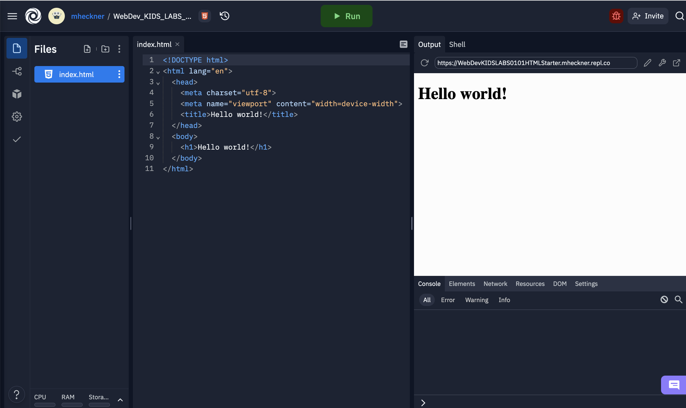

# Setup

## Registrieren 

Registrieren Sie sich unter  [https://replit.com/signup?from=landing](https://replit.com/signup?from=landing) mit Ihrer studentischen E-Mailadresse. Verwenden Sie einen Usernamen, unter dem man Sie identifizieren kann (beispielsweise mheckner für Markus Heckner).

## Projekt starten

Um möglichst schnell mit der Entwicklung zu starten, erhalten Sie für dieses Lab einen Startercode.
Bitte klicken Sie auf den folgenden Link und "forken" sich das folgende Projekt:
[https://replit.com/@WebdevKIDS/WebDevKIDSLABS0101HTMLStarter](https://replit.com/@WebdevKIDS/WebDevKIDSLABS0101HTMLStarter)


Jetzt sollten Sie einen Kopie dieses *repls* in Ihrem eigenen replit Account erhalten haben, die Sie beliebieg bearbeiten können. 

## Web IDE replit

Die IDE Replit besteht aus 4 Elementen:


- FileExplorer (linke Seite) zur Auswahl der zu editierbaren Files (hier nur ```index.html```)
- Editor (Mitte) zur Bearbeitung des Quellcode
- **Run** Button startet einen Webserver in *replit*, um die Webseite anzuzeigen (nächster Punkt)
- Anzeige (rechts oben) - hier werden HTML Dateien angezeigt. Mit Klick auf das Symbol mit dem Rechteck und dem Pfeil können Sie die Webseite in einem eigenen Browsertab ansehen.
- Console und Shell (unten rechts) - für Debugging, direkter Eingabe von Kommandos


## Warum Replit?

Um den Einstieg in das Thema Web-Development noch einfacher zu gestalten, lässt sich statt eine installierte Entwicklungsumgebung auch ein Online Editor verwenden.

Mit *replit* kann man in die Webentwicklung einsteigen, ohne eigene Software installieren zu müssen. Weiterhin bietet *replit* einen eigenen Webserver, um die Seiten direkt im Web zu veröffentlichen. Der Code ist weiterhin von jedem Gerät mit einem Internetbrowser bearbeitbar.
