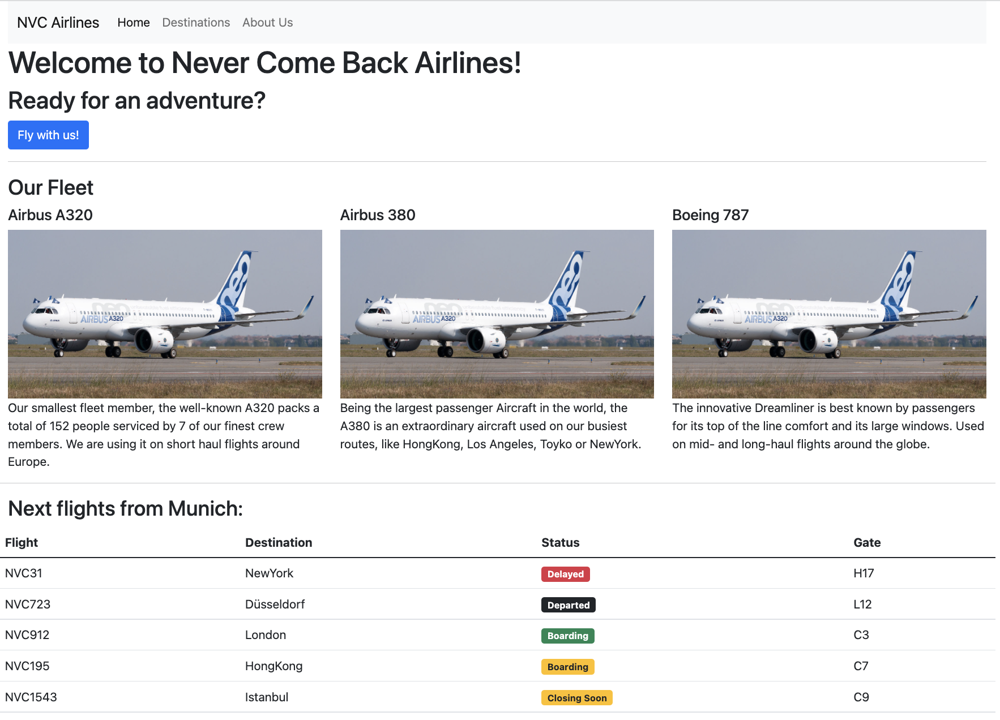

## Schritt für Schritt

Erstellen sie die folgende Seite:



Gehen Sie wie folgt bei der Lösung vor:

* Alle Inhalte sind direkte Kindelemente des Elements `<div class="container">`

* Orientieren Sie sich bei der Navigation an der Dokumentation der Bootstrap Navbar: [https://getbootstrap.com/docs/5.3/components/navbar/](https://getbootstrap.com/docs/5.3/components/navbar/)

* `Welcome to Never Come Back Airlines!` ist eine `<h1>` Element

* `Ready for an adventure?` ist eine `<h2>` Element

* `Fly with us!` ist ein Bootstrap Button: [https://getbootstrap.com/docs/5.3/components/buttons/](https://getbootstrap.com/docs/5.3/components/buttons/)

* Die horizontale Linie ist eine `<hr>` Element (*horizontal line*)

* `Our Fleet` ist eine `<h3>`

* Die einzelnen Spalten zu den Flugzeugen sind Bootstrap columns, die sich den Platz gleichmäßig teilen (`<div class="col">`), alle Spalten sind Kindelemente eines Elements `  <div class="row">`

* Die Bilder der Flugzeuge haben die Klasse `img-fluid` und können wie folgt eingebunden werden:
  ```html
  
  
  
  ```

* Die Dokumentation für Bootstrap Tabellen finden Sie hier: [https://getbootstrap.com/docs/5.3/content/tables/](https://getbootstrap.com/docs/5.3/content/tables/)

* Die Texte *Delayed*, *Departed*, etc. sind Bootstrap Badges: [https://getbootstrap.com/docs/5.3/components/badge/](https://getbootstrap.com/docs/5.3/components/badge/)

*Hinweis:* Wenn Sie die Seite mit einem mobilen Endgerät aufrufen oder das Browserfenster verkleinern, passt sich die Navigationsleiste responsiv an und zeigt einen *Hambuerger-Button* anstatt die einzelnen Menüpunkte. Wenn Sie diesen klicken, wird er aber nicht ausgeklappt und zeigt die versteckten Menüpunkte nicht an. Damit das funktioniert, müssen Sie ein von Bootstrap bereitgestelltes JavaScript-File in Ihre Webseite einbinden. Fügen Sie dazu den folgenden Code eine Zeile vor dem schließenden Tag `</body>` ein:

```html
<script src="https://cdn.jsdelivr.net/npm/bootstrap@3.3.7/dist/js/bootstrap.min.js" integrity="sha384-Tc5IQib027qvyjSMfHjOMaLkfuWVxZxUPnCJA7l2mCWNIpG9mGCD8wGNIcPD7Txa" crossorigin="anonymous"></script>
```

