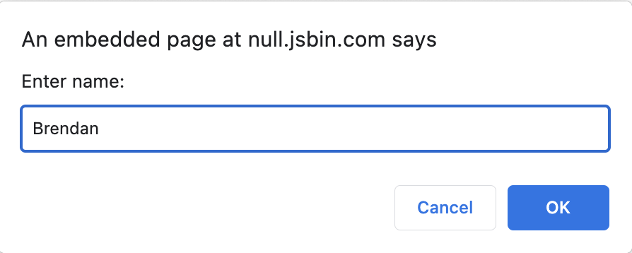

# Variablen

Schreiben Sie ein kleines Skript, das Sie zur Eingabe Ihres Namens auffordert, den Namen in einer Variable speichert und diesen dann auf der Konsole ausgibt.

Das Einlesen des Namens sollte wie folgt aussehen...

... und die Ausgabe so:

~~~js
"Your name is Brendan!"
~~~

