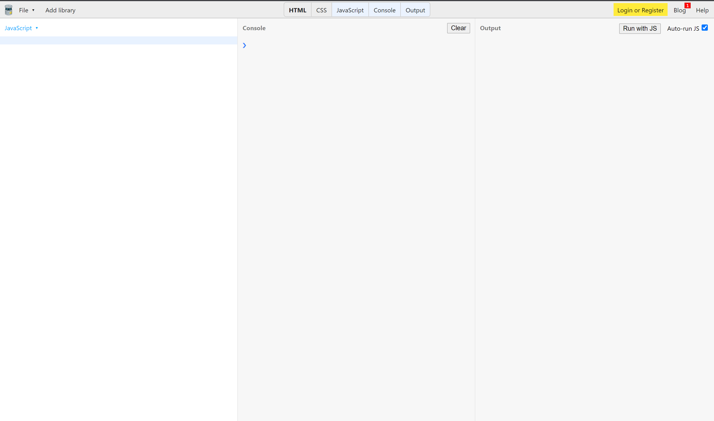
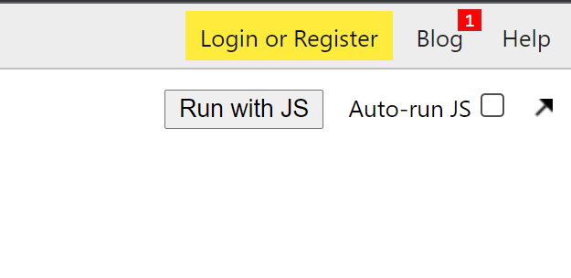

# Setup

## Vorbereitung

1. Öffnen Sie folgenden Link:
   (JS Bin)[https://jsbin.com/?js,console]
   
   Sie Sollten nun folgende Oberfläche sehen:

Im Linken Bereich werden Sie gleich Ihren Code eintippen. Der mittlere Bereich ist die Console, in der Sie mit Ihrem Javascript interagieren können.
Der rechte Bereich spielt für uns keine Rolle. Wichtig ist aber, dass Sie dort neben dem "Run" Button das Häkchen entfernen.

Mit dem Button **"Run with JS"** können Sie Ihr Skript dann starten.
