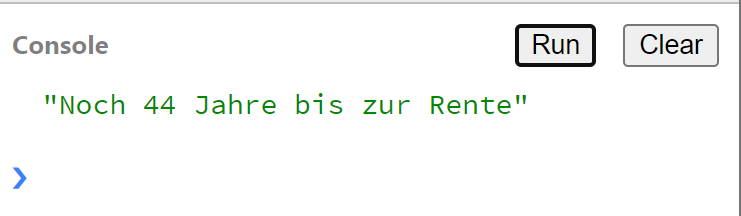

# Kontrollstrukturen

- Fragen Sie den Nutzer mittels eines `prompt` nach seinem Alter
- Prüfen Sie ob der Nutzer älter als 67 jahre ist, falls nein, dann geben Sie auf der Konsole die Jahre bis zur Rente (mit 67 Jahren) aus
- Falls der Nutzer älter als 67 Jahre ist, dann geben Sie auf der Console einen Text aus "Sie Sind schon in Rente!"

Auf der Konsole dürften Sie zum Beispiel dann folgendes lesen:

