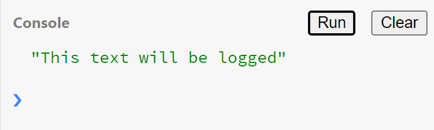
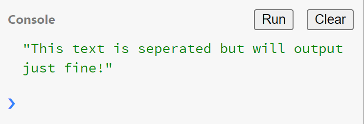
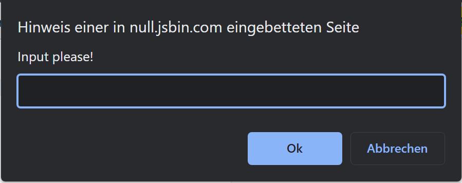
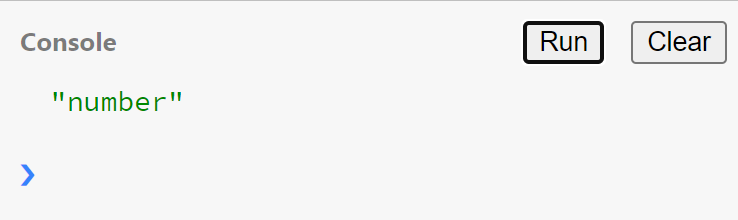

# Javascript Übungen

### Aufgabe 1
- Geben Sie Ihren Namen auf der Console aus. 

***Tipp***: 
~~~javascript
console.log("This text will be logged")
~~~

Auf der Konsole dürften Sie dann folgendes lesen:

### Aufgabe 2

- Legen Sie eine Variable an, in der ihr Vorname steht und geben Sie die Variable aus.

***Tipp***:
~~~javascript
let variable = MyInput
console.log(variable)
~~~

### Aufgabe 3

- Legen sie eine Variable an, die den Namen dieses Kurses enthalten soll.
- Erstellen Sie weitere Variable, die die durschnittliche Bewertung des Kurses enthält.
- Geben Sie die durchschnitliche Bewertung auf der Console verständlich aus - zum Beispiel:
***Die durchschnittliche Bewertung des Kurses Webtechnologien ist 5,0 Sterne***

***Tipp***:
~~~javascript
console.log("This text" + " is seperated" + " but will output just fine!")
~~~

Auf der Konsole dürften Sie dann folgendes lesen:

### Aufgabe 4
- Fragen Sie den Nutzer nun nach der Bewertung des Kurses mithilfe von `prompt` und speichern diese in der Variable `bewertung`

***Tipp***:
~~~javascript
let test = prompt("Input please!")
// ...
~~~

Input wird in JsBin wie folgt abgefragt:

### Aufgabe 5
- Speichern sie das heutige Datum in eine Variable
  - Lässt sich das Datum einfach so speichern?
  - Falls nicht, speichern Sie das Datum in einen String
- Speichern Sie die Zahl 3.1315 in eine Variable
- Welcher Datentyp hat diese Variable?
- Was passiert wenn Sie die Zahl 3.1415 in einen Integer speichern wollen? 
- Parsen Sie die Zahl, um Sie abzuspeichern

***Tipp***:
~~~javascript
console.log(typeof (variable)) // gibt den Typ einer Variable aus
// ...
let pi = parseFloat("3.1415") // parsed einen Input in eine Variable
console.log(typeof(pi))

~~~
Obige letzten 2 Zeilen ergeben dabei zum Beispiel folgenden Output:

### Aufgabe 6
- Fragen Sie den Nutzer (`prompt`) nach seinem Alter
- Prüfen Sie ob der Nutzer älter als 67 jahre ist, wenn nein:
  - Geben Sie auf der Console die Jahre bis zur Rente (mit 67 Jahren) aus
- Wenn Ja, Geben Sie auf der Console einen Text aus "Sie Sind schon in Rente!"

Auf der Konsole dürften Sie zum Beispiel dann folgendes lesen:

