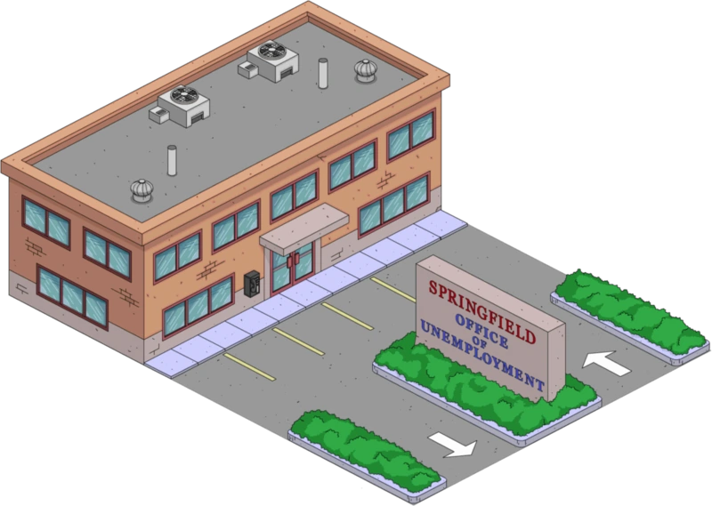

# Ziele

Das bereits vorhin angefangene Projekt kann nun erweitert werden und übersichtlicher gemacht werden, nachdem Sie soeben gelernt haben, wie Javascript Dateien modularisiert werden können.

## Modularisierung von Javascript

### Willkommen zurück im Arbeitsamt von Springfield! 

Nachdem Sie eine Übersicht über unsere Mitbewohner geschaffen haben, können wir nun anfangen Jobs zu speichern, und diese unseren Simpsons zu empfehlen.
