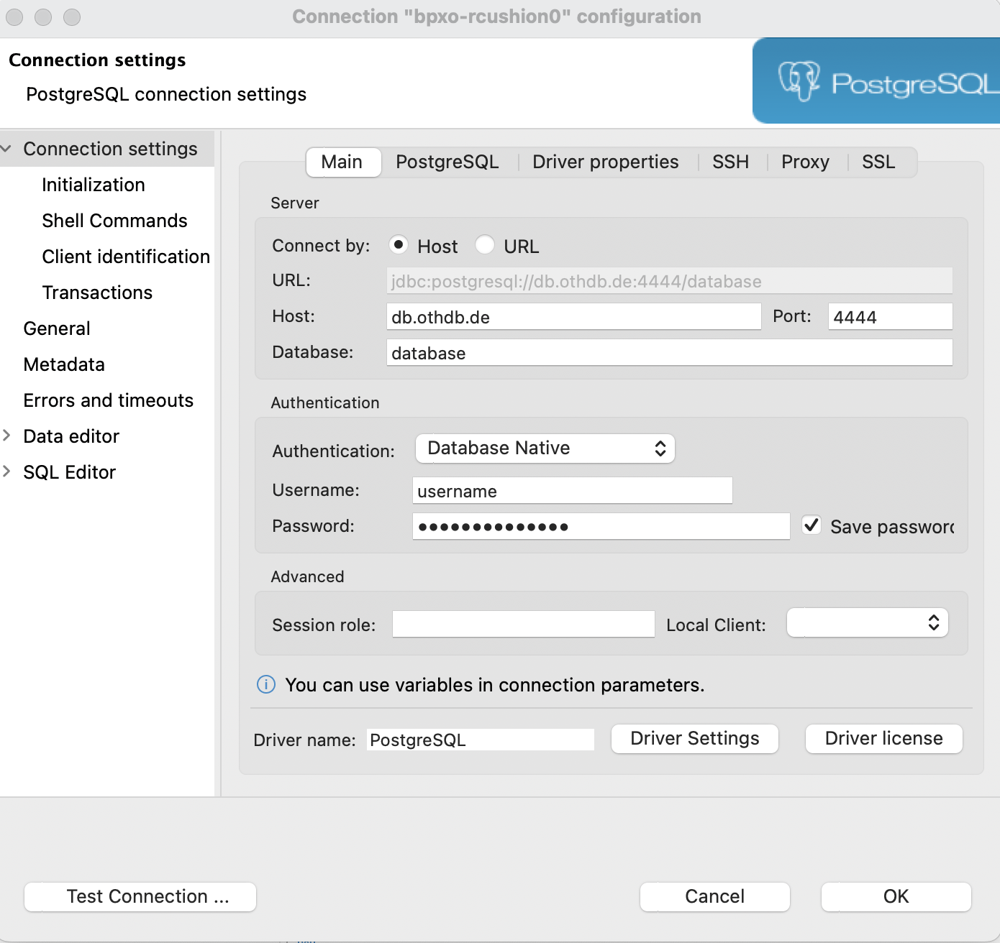

## Setup

Für diese Aufgabe steht Ihnen wieder ein Startercode zur Verfügung. Dieser Code entspricht der Playlist-App nach dem ersten Lab.

Gehen Sie wie folgt vor, um ein neues replit mit diesem Startercode zu erstellen:

Loggen Sie sich unter [replit.com](replit.com) ein und Klicken auf das `+ Create` im Menü, um ein neues repl anzulegen. Wählen Sie dort "Import from Github" und kopieren die folgende URL in das Feld "GitHub URL":

```
https://github.com/OTHRegensburgWebDevKIDS/playlist-1
```

* Erzeugen Sie das repl mit Klick auf "+ Import from GitHub".
* Klicken Sie dann auf den Button "Done"

Geben Sie in der Shell die folgenden Befehle ein, um die benötigten Packages zu installieren und die Web-App zu starten:

```shell
npm install
```

```shell
node app.js
```

Die App sollte starten und Sie sollten die Startseite der App im Browser ansehen können:


In diesem Lab soll die Web-App durch die Anbindung einer Datenbank, sowie neue Features erweitert werden.

#### Einrichtung PostgreSQL

Für diesen Release benötigen Sie eine PostgreSQL Datenbank. Diese wird Ihnen kostenlos von der OTH bereitgestellt.

Die Verbindung zur Datenbank können Sie z.B. mit den Tool *DBeaver* herstellen, das bereits auf den CIP-Poolrechnern installert ist. Sie sich *DBeaver* für Ihren eigenen Rechner auf der folgenden Seite herunterladen https://dbeaver.io/download/.

Mit diesem Tool können Sie SQL-Queries an den Server schicken oder sich den Inhalt und die Struktur von Tabellen per Mausklick anzeigen lassen.

Starten Sie *DBeaver* und geben die folgenden Verbindungsdaten ein:



Hinweis: In ELO finden Sie die Zugangsdaten, die Sie für diese Aufgabe verwenden können.

Verbinden Sie sich mit dem Datenbankserver und Klicken Sie dann auf den Button *SQL*, um die *SQL-Console* zu öffnen, in der sie SQL-Befehle zum erstellen der Datenbanktabellen eingeben können (vgl. nächster Abschnitt).

### Datenbank mit Inhalt füllen

Führen Sie die folgenden Befehle aus um zwei Tabellen für Playlisten und darin gespeichert Songs anzulegen.

~~~ shell
DROP TABLE IF EXISTS playlist2_playlists;
DROP TABLE IF EXISTS playlist2_songs CASCADE;

CREATE TABLE playlist2_playlists (
  ID SERIAL PRIMARY KEY,
	TITLE VARCHAR
);

INSERT INTO playlist2_playlists (TITLE) VALUES ('Happy Mood');
INSERT INTO playlist2_playlists (TITLE) VALUES ('Iconic songs');

CREATE TABLE playlist2_songs (
	ID SERIAL PRIMARY KEY,
	TITLE VARCHAR,
	ARTIST VARCHAR,
	DURATION INTEGER,
	PLAYLIST_ID INTEGER REFERENCES playlist2_playlists ON DELETE CASCADE 
);

INSERT INTO playlist2_songs (TITLE, ARTIST, DURATION, PLAYLIST_ID) VALUES ('Valerie', 'Amy Winehouse', 90, 1);
INSERT INTO playlist2_songs (TITLE, ARTIST, DURATION, PLAYLIST_ID) VALUES ('22', 'Taylor Swift', 180, 1);
INSERT INTO playlist2_songs (TITLE, ARTIST, DURATION, PLAYLIST_ID) VALUES ('Happy', 'Pharrell Williams', 120, 1);

INSERT INTO playlist2_songs (TITLE, ARTIST, DURATION, PLAYLIST_ID) VALUES ('Smells Like Teen Spirit', 'Nirvana', 180, 2);
INSERT INTO playlist2_songs (TITLE, ARTIST, DURATION, PLAYLIST_ID) VALUES ('Bohemian Rhapsody', 'Queen', 150, 2);
INSERT INTO playlist2_songs (TITLE, ARTIST, DURATION, PLAYLIST_ID) VALUES ('Imagine', 'John Lennon', 210, 2);
~~~

Jeder Song gehört zu genau einer Playlist (vgl. den Fremdschlüssel `playlist_id` der Tabelle songs.

In den folgenden Schritten des Labs sollen Sie Ihre Web-App um eine Datenbankanbindung erweitern, welche die obigen Tabellen verwendet.
