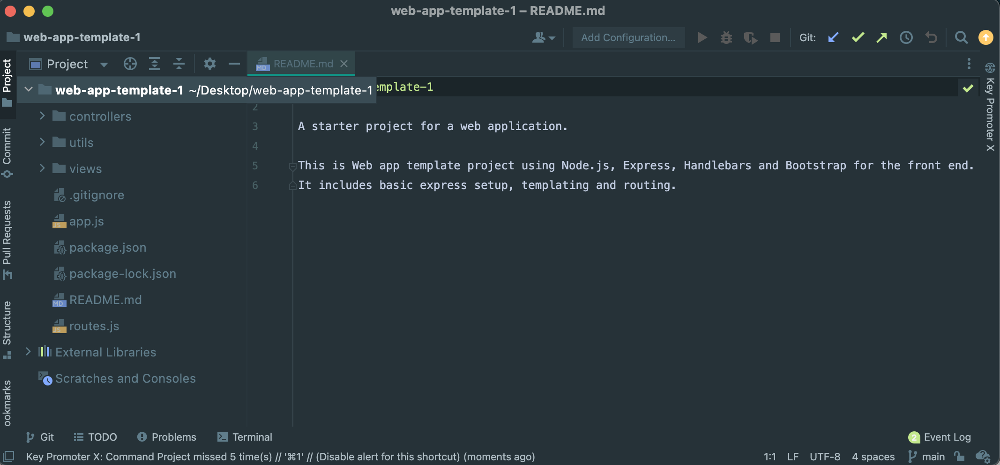

# Git

Git ist ein Tool mit dem Sourcecode versioniert und denzentral gespeichert werden kann. Vergewissern Sie sich das Git installiert ist. Dazu kann in der Kommandozeile folgender Befehl ausgeführt werden:

~~~ shell
git --version
~~~

Sollten Sie keine Antwort mit Ihrer installierten Versionsnummer erhalten laden Sie sich Git bitte hier herunter:
(https://git-scm.com/)[https://git-scm.com/]

**Hinweis:**  Git ist im CIP-Pool bereits installiert.

## Klonen eines Startercodes und öffnen des Projekts in WebStorm

Sie finden unter dem [https://github.com/OTHRegensburgWebDevKIDS/web-app-template-1](https://github.com/OTHRegensburgWebDevKIDS/web-app-template-1) einen Startercode für eine einfache Web-Anwendung.

Dieser Code soll nun mit Git heruntergeladen (gecloned) werden und dann in WebStorm geöffnet werden:
Bitte öffnen Sie dazu erneut die Kommandozeile und navigieren sie in ein leeres Verzeichnis Ihrer Wahl.
Empfehlung ist ein Verzeichnis für alle kommenden Projekte anzulegen. Die folgenden Befehle legen zuerst einen Ordner ```repos``` an, wechseln dann in diesen Ordner, erstellen einen Ordner ```web-dev``` und wechseln zuletzt auch in diesen Ordner:

~~~ shell
mkdir repos
cd repos
mkdir web-dev
cd web-dev
~~~

Klonen Sie sich dann das Beispielprojekt:

~~~ shell
git clone https://github.com/OTHRegensburgWebDevKIDS/web-app-template-1
~~~

Git erstellt dann einen neuen Ordner und lädt alle Inhalte des Github Repositories in diesen Ordner herunter. Diese finden Sie dann auch im Explorer.
Über einen Rechtsklick können Sie diesen neuen Ordner dann auch in WebStorm als Projekt öffnen.

Wählen Sie dazu in WebStorm aus dem Menü **Datei => Öffnen** oder die Option **Öffnen** direkt aus dem WebStorm Startscreeen.

Das Ergebnis sollte wie folgt aussehen:



