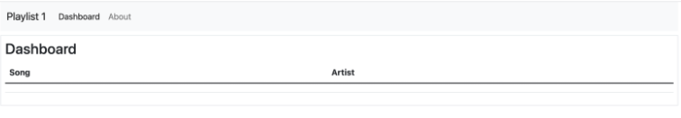

## Statische Playlists 
### Route Controller View

### 4. Einfügen eines neuen Views

Erstellen Sie in dem View Ordner eine neue Datei `dashboard.hbs` und kopieren Sie folgende Zeilen Code dahinein.

~~~ handlebars
    {{> menu id="dashboard"}} 
     
    
 
      <h3>Dashboard</h3> 
    
 
~~~

Damit der View auch erreichbar ist, muss ein neuer Controller angelegt werden.
Erstellen Sie dazu eine neue Datei im Ordner `controllers` mit dem namen `dashboard.js`

In dieser datei müssen Sie nun folgenden Code ergänzen:
~~~ js
const logger = require("../utils/logger.js");
const playListCollection = require("../models/playlist-store.js");

const dashboard = {
  index(request, response) {
    logger.info("dashboard rendering");
    const viewData = {
      title: "Dashboard",
      playlists: playListCollection
    };
    logger.info('about to render', playListCollection);
    response.render("dashboard", viewData);
  }
};

module.exports = dashboard;

~~~

Nun haben wir einen Controller und einen View. Es fehlt also nur noch das Routing einer Nutzeranfrage.
Dafür benötigen Sie die Datei `routes.js`.
In Dieser müssen Sie zwei Zeilen ergänzen. 

1. Den Import des Dashboard Routers (Siehe Zeile 4 und 5)
`const dashboard = require("./controllers/dashboard.js");`
2. Die Weiterleitung des Routers an den Controller des Dashboards unter der Adresse: `/dashboard`
`router.get("/dashboard", dashboard.index);`

Damit die Seite aufrufbar ist, müssen Sie nun alle Dateien gespeichert haben und können Ihren Server dann neustarten.
  
Die neue Seite müsste nun so aussehen:

### Anzeige einer Playlist
In der geschaffenen neuen View soll nun Ihre Playlist angezeigt werden.
Dazu ergänzen Sie bitte in Ihrer dashboard.hbs folgende Codezeile:
`{{> listsongs}} `, sodass die gesamte Datei wie folgt aussieht:

~~~ handlebars
    {{> menu id="dashboard"}} 
     
    
 
      <h3>Dashboard</h3> 
      {{> listsongs}} 
    
  
~~~
Nach dem Speichern und einem Neu-Laden sollte Ihre Seite dann wie folgt aussehen: 

### Auslagern der Tabelle

Die Tabell mit Ihren Lieblinglingssongs möchten wir nun auslagern und in einer eigenen Datei speicher, die Sie dann über den soeben ergänzten Code in das Dashboard laden.

Legen Sie dazu in dem Ordner `partials` eine neue Datei `listsongs.hbs` an und ergänzen Sie darin folgenden Code:
~~~ html

 <tbody> 
    <tr> 
        <td>Happy</td> 
        <td>Pharrell Williams</td> 
    </tr> 
    <tr> 
        <td>Get Lucky</td> 
        <td>Daft Punk</td> 
    </tr> 
    <tr> 
        <td>Don’t Worry, Be Happy</td> 
        <td>Bobby McFerrin</td> 
    </tr> 
</tbody> 

~~~
Die neue Seite müsste nun so aussehen:

Sehen Sie sich anschließend die Logausgaben an und überprüfen Sie, wo diese in ihrem Code erzeugt werden:
~~~
{
message: 'dashboard rendering',
level: 'info',
label: 'Web app template'
}
~~~
