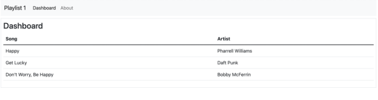

## Statische Playlists 
### Route Controller View

Wir wollen nun ein Dashboard in unsere App einfügen. Dafür benötigen wir ein View, ein Controller und das Routing, um zu der Seite zu gelangen.

### 1. Einfügen eines neuen Views

Erstellen Sie in dem `view` Ordner eine neue Datei `dashboard.hbs` und kopieren Sie folgende Zeilen Code dahinein.

~~~ handlebars
    {{> menu id="dashboard"}} 
     
    
 
      <h3>Dashboard</h3> 
    
 
~~~

### 2. Erstellen eines Controllers

Damit der View auch erreichbar ist, muss ein neuer Controller angelegt werden.
Erstellen Sie dazu eine neue Datei im Ordner `controllers` mit dem namen `dashboard.js`.

In dieser datei müssen Sie nun folgenden Code ergänzen:

~~~ js
const logger = require("../utils/logger.js");
const playListCollection = require("../models/playlist-store.js");

const dashboard = {
  index(request, response) {
    logger.info("dashboard rendering");
    const viewData = {
      title: "Dashboard",
      playlists: playListCollection
    };
    logger.info('about to render', playListCollection);
    response.render("dashboard", viewData);
  }
};

module.exports = dashboard;
~~~

Das `dashboard` Objekt werden wir nun nutzen, um den Controller aufzurufen.

### 3. Routing hinzufügen
Es fehlt nun noch das Routing einer Nutzeranfrage.
Dafür benötigen Sie die Datei `routes.js` im Hauptverzeichnis.
In Dieser müssen Sie zwei Zeilen ergänzen. 

1. Den Import des Dashboard Routers (Siehe Zeile 4 und 5)

`const dashboard = require("./controllers/dashboard.js");`
2. Die Weiterleitung des Routers an den Controller des Dashboards unter der Adresse: `/dashboard`

`router.get("/dashboard", dashboard.index);`

Damit die Seite aufrufbar ist, müssen Sie nun alle Dateien gespeichert haben und können Ihre App dann neustarten.
  
Die neue Seite müsste nun so aussehen:

### 4. Anzeige einer Playlist

In der geschaffenen neuen View soll eine Übersicht Ihrer Playlist angezeigt werden.

Die Tabelle mit Ihren Lieblinglingssongs möchten wir auslagern und in einer eigenen Datei speichern, die Sie dann in das Dashboard laden können.

Legen Sie dazu in dem Ordner `partials` eine neue Datei `listsongs.hbs` an und ergänzen Sie darin folgenden Code:
~~~ html
 <tbody> 
    <tr> 
        <td>Happy</td> 
        <td>Pharrell Williams</td> 
    </tr> 
    <tr> 
        <td>Get Lucky</td> 
        <td>Daft Punk</td> 
    </tr> 
    <tr> 
        <td>Don’t Worry, Be Happy</td> 
        <td>Bobby McFerrin</td> 
    </tr> 
</tbody> 
~~~

### 5. Anzeige des Partials
Die (noch) statische Tabelle muss nun in das Dashboard integriert werden.
Dazu ergänzen Sie bitte in Ihrer `dashboard.hbs` folgende Codezeile:
`{{> listsongs}} `, sodass die gesamte Datei wie folgt aussieht:

~~~ handlebars
    {{> menu id="dashboard"}} 
     
    
 
      <h3>Dashboard</h3> 
      {{> listsongs}} 
    
  
~~~
Nun integriert Ihr dashboard die beiden Partials `menu` und `listsongs`.

Nach dem Speichern der Dateien und einem Refresh der Seite im Browser müsste die fertige Seite wie folgt aussehen:

Sehen Sie sich anschließend auch die Logausgaben an und überprüfen Sie, wo diese in ihrem Code erzeugt werden:
~~~
{
message: 'dashboard rendering',
level: 'info',
label: 'Web app template'
}
~~~
