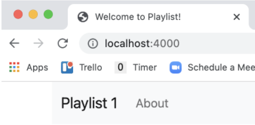
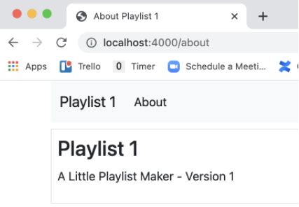

## Views anpassen

Finden Sie den richtigen View und passen Sie ihn so an, dass die App wie folgt aussieht:

Finden Sie den nächsten View und passen sie ihn so an, dass die App wie folgt aussieht:

Controller anpassen

Passen Sie beide Controller so an, dass die App wie folgt aussieht:

~~~ handlebars
    {{> menu id="dashboard"}} 
     
    
 
      <h3>Dashboard</h3> 
    
 
~~~

