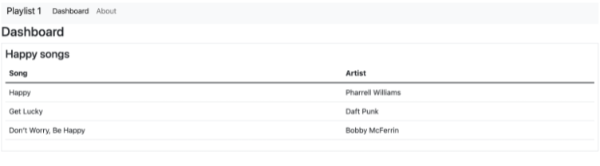
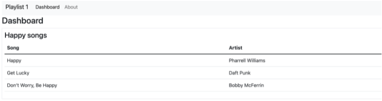

### Dynamische Playlist

~~~handlebars
<tbody> 
    {{#each playlist.songs}} 
        <tr> 
            <td>{{title}}</td> 
            <td>{{artist}}</td> 
        </tr> 
    {{/each}} 
</tbody> 
~~~
~~~ js
const playList = { 
  title: "Happy songs", 
  songs: [ 
    { 
      title: "Happy", 
      artist: "Pharrell Williams", 
    }, 
    { 
      title: "Get Lucky", 
      artist: "Daft Punk", 
    }, 
    { 
      title: "Don’t Worry, Be Happy", 
      artist: "Bobby McFerrin", 
    }, 
  ], 
}; 
~~~

Dashboard anpassen
~~~ handlebars

{{> menu id="dashboard"}} 
<h3>Dashboard</h3> 
 

 
    <h4>Happy songs</h4> 
    {{> listsongs}} 

 

~~~

~~~ handlebars
    logger.info('about to render', playList); 
~~~

~~~ json
title: 'Happy songs', 

  songs: [ 

    { title: 'Happy', artist: 'Pharrell Williams' }, 

    { title: 'Get Lucky', artist: 'Daft Punk' }, 

    { title: 'Don’t Worry, Be Happy', artist: 'Bobby McFerrin' } 

  ], 

  level: 'info', 

  message: 'about to render', 
~~~

~~~js
const logger = require("../utils/logger.js"); 
 
const playList = { 
  title: "Happy songs", 
  songs: [ 
    { 
      title: "Happy", 
      artist: "Pharrell Williams", 
    }, 
    { 
      title: "Get Lucky", 
      artist: "Daft Punk", 
    }, 
    { 
      title: "Don’t Worry, Be Happy", 
      artist: "Bobby McFerrin", 
    }, 
  ], 
}; 
 
module.exports = playList; 
~~~

~~~js
const logger = require("../utils/logger.js"); 
const playList = require("../models/playlist-store.js"); 
 
const dashboard = { 
  index(request, response) { 
    logger.info("dashboard rendering"); 
    const viewData = { 
      title: "Dashboard", 
      playlist: playList 
    }; 
    logger.info('about to render', playList); 
    response.render("dashboard", viewData); 
  } 
}; 
 
module.exports = dashboard; 
~~~

