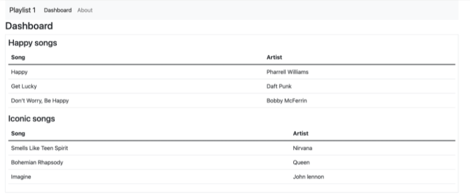

### Mehrere Playlists

~~~ js
    const logger = require("../utils/logger.js"); 
 
const happySongs = { 
  title: "Happy songs", 
  songs: [ 
    { 
      title: "Happy", 
      artist: "Pharrell Williams", 
    }, 
    { 
      title: "Get Lucky", 
      artist: "Daft Punk", 
    }, 
    { 
      title: "Don’t Worry, Be Happy", 
      artist: "Bobby McFerrin", 
    }, 
  ], 
}; 
 
const iconicSongs = { 
  title: "Iconic songs", 
  songs: [ 
    { 
      title: "Smells Like Teen Spirit", 
      artist: "Nirvana", 
    }, 
    { 
      title: "Bohemian Rhapsody", 
      artist: "Queen", 
    }, 
    { 
      title: "Imagine", 
      artist: "John lennon", 
    }, 
  ], 
}; 
 
const playlistCollection = [happySongs, iconicSongs]; 
 
module.exports = playlistCollection; 
~~~

~~~ js
const playlistCollection = [happySongs, iconicSongs]; 
module.exports = playlistCollection; 
~~~

~~~ js
    const logger = require("../utils/logger.js"); 
    const playListCollection = require("../models/playlist-store.js"); 
     
    const dashboard = { 
      index(request, response) { 
        logger.info("dashboard rendering"); 
        const viewData = { 
          title: "Dashboard", 
          playlists: playListCollection 
        }; 
        logger.info('about to render', playListCollection); 
        response.render("dashboard", viewData); 
      } 
    }; 
     
    module.exports = dashboard; 
~~~

~~~ html
    {{> menu id="dashboard"}} 
    <h3>Dashboard</h3> 
     
    
 
        {{#each playlists}} 
            <h4>{{title}}</h4> 
            {{> listsongs}} 
        {{/each}} 
    
 
~~~

