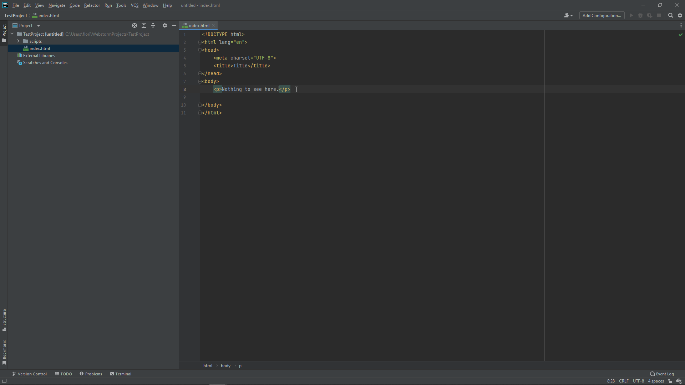

# Einleitung Webstorm

## Übersicht über IDE

#### Nice to know

In Webstorm müssen Sie Dateien nicht selbstständig speichern. Periodisch und beim schließen von Webstorm werden alle Dateien automatisch gespeichert.

#### Navigation

In der Leiste am oberen Rand des Bildschirms finden Sie die Navigationsleiste. Dort können Sie alle wichtigen Einstellungen vornehmen, neue Projekte starten, bestimmte Sichten einstellen oder weitere verschiedenste Funktionen finden.

#### FileExplorer
In dem FileExplorer auf der linken Seite können Sie die Datei ihrer Wahl wählen und diese im Editorfenster zur Bearbeitung öffnen.

#### Editorfenster
Hier passiert die Magie. Alle Dateien werden hier editiert und die Applikation so mit Leben gefüllt. Webstorm unterstützt Syntax-Highlighting für nahezu alle wichtigen Web-Sprachen.

#### Weiteres: 
Am linken oder unteren Display Rand haben Sie die Möglichkeit verschiedene Sichten dazu zu schalten. Dazu gehören ein Termin, eine ToDo Liste, die VersionControl (Git Unterstützung) und vieles mehr.
Insbesondere das Terminal werden Sie für die Entwicklung mit Node öfter verwenden.
