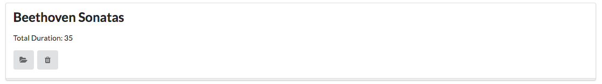
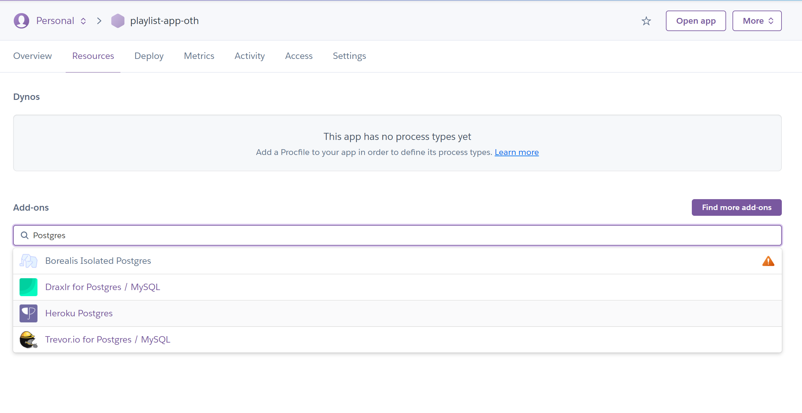

### Projekt starten

Sollten Sie im letzten Lab alle Aufgaben problemlos gelöst haben, nutzen Sie Ihren vorhandenen Code als Start.
Alternativ, können Sie auch diesen Startercode (Lösung des letzten Labs) importieren.
~~~shell
   
git clone https://https://github.com/OTHRegensburgWebDevKIDS/playlist-1.git
~~~

#### Einrichtung PostgreSQL

Für dieses Lab benötigen Sie zuerst eine PostgreSQL Datenbank. Folgen Sie den folgenden Schritten, um sich diese Datenbank einzurichten.
Es wird empfohlen sich bei Heroku (kostenfrei) eine Datenbank anzulegen. 

Bitte folgen Sie dazu folgenden Schritten: 

1. Navigieren Sie zu (Heroku)[https://www.heroku.com/]

2. Legen Sie sich einen Account an 
3. Legen Sie ein neues Projekt an

4. Geben Sie Ihrer App einen Guten Namen und wählen Sie Europa als Region

5. Konfigurieren Sie das `Heroku Postgres` Addon im Resources Tab der App Übersicht

6. Bitte achten Sie darauf den Free Hobby Plan ausgewählt zu haben. Sonst ist Ihre DB nicht mehr kostenfrei.

7. Klicken Sie auf Ihre Datenbank

8. Sie sehen nun eine Übersicht über Ihre Datenbank in einem neuen Tab.
9. Im Settings Bereich Ihrer App können Sie sich dann auch die wichtigen Zugangsdaten anzeigen lassen. 

10. Merken Sie sich den DB ConnectionString 

### Datenbank mit Inhalt füllen

Loggen Sie sich dann bei (Adminer)[https://adminer.cs50.net/] ein, klicken auf SQL Command und führen Sie die folgenden Befehle aus um zwei Tabellen für Playlisten und darin gespeichert Songs anzulegen. 

~~~ shell
    DROP TABLE IF EXISTS playlist2_playlists; 
    DROP TABLE IF EXISTS playlist2_songs CASCADE; 
     
    CREATE TABLE playlist2_playlists ( 
       ID SERIAL PRIMARY KEY, 
       TITLE VARCHAR 
    ); 
     
    INSERT INTO playlist2_playlists (TITLE) VALUES ('Happy Mood'); 
    INSERT INTO playlist2_playlists (TITLE) VALUES ('Iconic songs'); 
     
    CREATE TABLE playlist2_songs ( 
      ID SERIAL PRIMARY KEY, 
      TITLE VARCHAR, 
      ARTIST VARCHAR, 
      DURATION INTEGER, 
      PLAYLIST_ID INTEGER REFERENCES playlist_playlists ON DELETE CASCADE 
    ); 
     
    INSERT INTO playlist2_songs (TITLE, ARTIST, DURATION, PLAYLIST_ID) VALUES ('Valerie', 'Amy Winehouse', 90, 1); 
    INSERT INTO playlist2_songs (TITLE, ARTIST, DURATION, PLAYLIST_ID) VALUES ('22', 'Taylor Swift', 180, 1); 
    INSERT INTO playlist2_songs (TITLE, ARTIST, DURATION, PLAYLIST_ID) VALUES ('Happy', 'Pharrell Williams', 120, 1); 
     
    INSERT INTO playlist2_songs (TITLE, ARTIST, DURATION, PLAYLIST_ID) VALUES ('Smells Like Teen Spirit', 'Nirvana', 180, 2); 
    INSERT INTO playlist2_songs (TITLE, ARTIST, DURATION, PLAYLIST_ID) VALUES ('Bohemian Rhapsody', 'Queen', 150, 2); 
    INSERT INTO playlist2_songs (TITLE, ARTIST, DURATION, PLAYLIST_ID) VALUES ('Imagine', 'John Lennon', 210, 2); 
~~~

Jeder Song gehört zu genau einer Playlist (vgl. den Fremdschlüssel playlist_id der Tabelle songs.

Die bestehende Ansicht sieht wie folgt aus:

Table

Description automatically generated with medium confidence

Soll ersetzt werden durch eine Anzeige der Playlist (ohne Songs auf dem Dashboard):

INSERT HERE

Und zusätzlich Anzeige der Songs bei Klick auf Playlist mit der Möglichkeit einen Song zu löschen:

INSERT HERE 