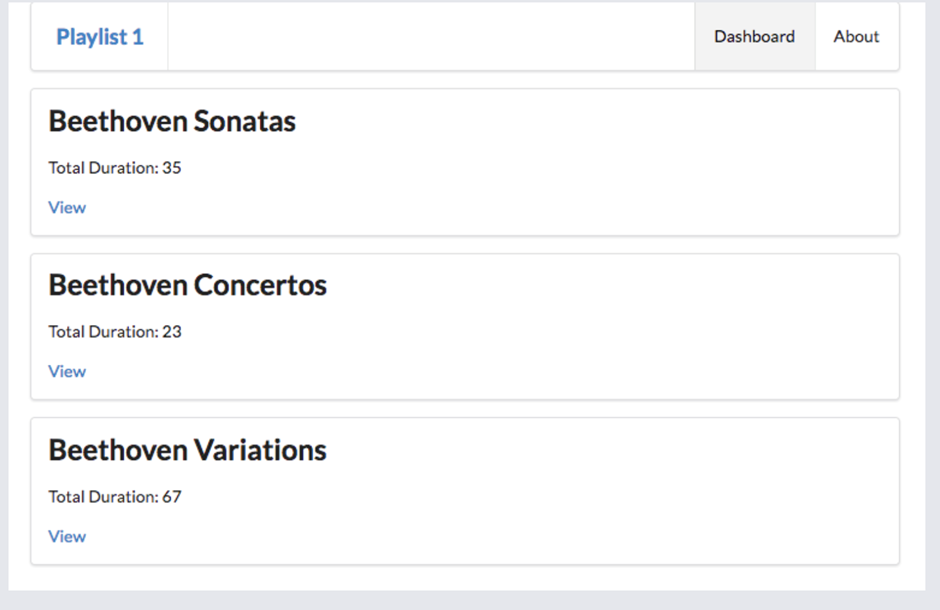

## Playlist Zusammenfassung

Das Dashboard soll jetzt nur noch eine Zusammenfassung Ihrer Playlists anzeigen:

### 1. View anpassen

Passen Sie dazu als erstes den View des Dashboards wie folgt an und löschen Sie die Integration des Partials `listsongs`.
(Erinnerung, Sie finden den View in: `views\dashboard.hbs`)

~~~ handlebars
{{> menu id="dashboard"}}
<h3>Dashboard</h3>

 
	{{#each playlists}} 
  	
 
    	<h4>{{title}}</h4> 
    
 
  {{/each}} 

 
~~~
Die Seite sollte jetzt wie folgt aussehen:

Die angezeigten Daten stammen aktuell aus dem statischen Model `playlist-store.js` (Siehe letzte Woche). Im nächsten Schritt ersetzen wir dieses Model gegen ein PostgreSQL Model, das die Daten aus einer Datenbank abfrägt. 
