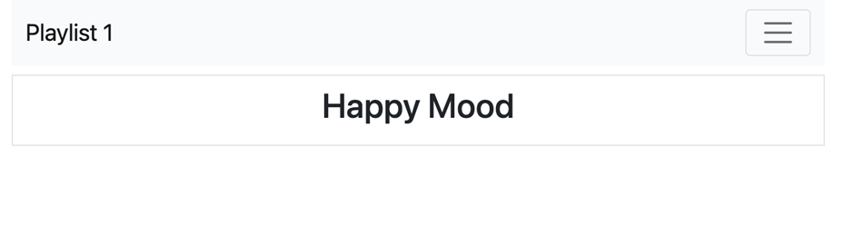

## Detailansicht der Playlisten

### Controller Anpassung

Um die Details der korrekten Playlist anzuzeigen, ist es notwendig die in der URL übergebende ID zu extrahieren. Dies geht am einfachsten mit dem Controller.
Passen Sie den Controller wie folgt an:
~~~js
asyn index(request, response) { 
    const playlistId = request.params.id; 
    const playlist = await playlistStore.getPlaylist(playlistId); 
    const viewData = { 
        title: 'Playlist', 
        playlist: playlist 
    }; 
    response.render('playlist', viewData); 
}, 
~~~
Die Konstante playlistId wird dabei durch den Eingabeparameter bestimmt. Den Namen des Parameters (`id`) haben Sie beim Routing bereits festgelegt.

Ergänzen Sie in Ihrem Router eine Logausgabe, sodass Sie die Funktionalität der Übergabe auch anhand Ihrer Logs verifizieren können.
Im Controller fehlt dabei folgende Zeile unter der Initialisierung der Konstante `playlistId`:

~~~ js
logger.info('Playlist id = ' + playlistId); 
~~~

Bei dem Aufruf von dem Link: localhost/playlists/1 dürften Sie dann folgenden Log auf der Console sehen können:
~~~ json
{
    message: 'Playlist id = 1',
    level: 'info',
    label: 'Web app template' 
}
~~~

### Model Anpassung
Damit Sie nun auch die korrekten Daten für eine Playlist erhalten, muss das Model um eine Funktion erweitert werden, die eine ID als Parameter erhält.

Ergänzen Sie Ihr Model (`playlist-store.js`) dafür mit der folgenden Funktion:

~~~ js 
async getPlaylist(id) { 
  const query = 'SELECT * FROM playlist2_playlists WHERE id=$1'; 
  const values = [id]; 
  try { 
    let result = await dataStoreClient.query(query, values); 
    return result.rows[0]; 
  } catch (e) { 
    logger.error("Error fetching playlist", e); 
  } 
}, 
~~~

Dieser Code versucht (try) von Ihrem dataStoreClient Daten zu erhalten und diese zurück zu geben.
Sollte ein Fehelr auftreten, wird ein Log erzeugt.

### View Anpassung: 

Der zuvor erstellte View hatte nur den Placeholder Text "More to come". Dies soll nun mit sinnvollem Text ersetzt werden.
Passen Sie die `playlist.hbs` Datei wie folgt an:
~~~ handlebars
    {{> menu}} 
 
    
 
        <h2 class="text-center">{{playlist.title}}</h2> 
    
 
~~~

So sollte Ihre Seite dann aussehen: 

Zum Abrufen der songs wird ein neues model song-store.js benötigt. Der nächste Abschnitt beschreibt die Erstellung und Integration dieses Models 