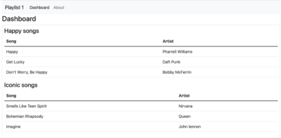

### Projekt starten

Importieren Sie den Startercode aus Github mit:

~~~shell
   
git clone https://github.com/OTHRegensburgWebDevKIDS/web-app-template-1.git
~~~

Öffnen Sie das Projekt dann in Webstorm und installieren alle wichtigen Softwaremodule mit:

~~~shell
npm install
~~~

Die App kann dann testweise mit 
~~~shell
node app.js
~~~
gestartet werden. Unter (https://localhost:4000)[https://localhost:4000]
können Sie Ihre App dann aufrufen und damit herumspielen.

Für dieses Lab benötigen Sie zuerst eine PostgreSQL Datenbank. Folgen Sie den folgenden Schritten, um sich diese Datenbank einzurichten.

[kleines Tutorial zu Heroku mit Ende Zugangsdaten / Credentials]

Loggen Sie sich dann bei Adminer ein, klicken auf SQL Command und führen Sie die folgenden Befehle aus um zwei Tabellen für Playlisten und darin gespeichert Songs anzulegen. 

~~~ shell
    DROP TABLE IF EXISTS playlist2_playlists; 
    DROP TABLE IF EXISTS playlist2_songs CASCADE; 
     
    CREATE TABLE playlist2_playlists ( 
       ID SERIAL PRIMARY KEY, 
       TITLE VARCHAR 
    ); 
     
    INSERT INTO playlist2_playlists (TITLE) VALUES ('Happy Mood'); 
    INSERT INTO playlist2_playlists (TITLE) VALUES ('Iconic songs'); 
     
    CREATE TABLE playlist2_songs ( 
      ID SERIAL PRIMARY KEY, 
      TITLE VARCHAR, 
      ARTIST VARCHAR, 
      DURATION INTEGER, 
      PLAYLIST_ID INTEGER REFERENCES playlist_playlists ON DELETE CASCADE 
    ); 
     
    INSERT INTO playlist2_songs (TITLE, ARTIST, DURATION, PLAYLIST_ID) VALUES ('Valerie', 'Amy Winehouse', 90, 1); 
    INSERT INTO playlist2_songs (TITLE, ARTIST, DURATION, PLAYLIST_ID) VALUES ('22', 'Taylor Swift', 180, 1); 
    INSERT INTO playlist2_songs (TITLE, ARTIST, DURATION, PLAYLIST_ID) VALUES ('Happy', 'Pharrell Williams', 120, 1); 
     
    INSERT INTO playlist2_songs (TITLE, ARTIST, DURATION, PLAYLIST_ID) VALUES ('Smells Like Teen Spirit', 'Nirvana', 180, 2); 
    INSERT INTO playlist2_songs (TITLE, ARTIST, DURATION, PLAYLIST_ID) VALUES ('Bohemian Rhapsody', 'Queen', 150, 2); 
    INSERT INTO playlist2_songs (TITLE, ARTIST, DURATION, PLAYLIST_ID) VALUES ('Imagine', 'John Lennon', 210, 2); 
~~~

Jeder Song gehört zu genau einer Playlist (vgl. den Fremdschlüssel playlist_id der Tabelle songs.

Für dieses Lab benötigen Sie eine funktionierende Version von playlist-1. Sie können Ihre eigene Version verwenden oder sich die fertige Version von diesem Repository clonen:

https://github.com/OTHRegensburgWebDevKIDS/playlist-1

Die bestehende Ansicht sieht wie folgt aus:

Table

Description automatically generated with medium confidence

Soll ersetzt werden durch eine Anzeige der Playlist (ohne Songs auf dem Dashboard):

INSERT HERE

Und zusätzlich Anzeige der Songs bei Klick auf Playlist mit der Möglichkeit einen Song zu löschen:

INSERT HERE 