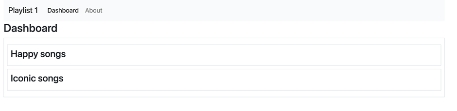

## Playlist Zusammenfassung

Im ersten Schritt soll das Dashboard nur noch eine Zusammenfassung der Playlists anzeigen: 

Passen Sie dazu zuerst den View wie folgt an:
Dashboard.hbs

~~~ handlebars
    
    {{> menu id="dashboard"}}
    <h3>Dashboard</h3>
    
    
 
        {{#each playlists}} 
        
 
            <h4>{{title}}</h4> 
        
 
        {{/each}} 
    
 

~~~

Die Seite sollte wie folgt aussehen: 

Die angezeigten Daten stammen jetzt aber noch aus dem statischen Model playlist-store.js aus dem Ordner Models. Im nächsten Schritt ersetzen wir dieses Model gegen ein PostgreSQL Model, das die Daten aus einer Datenbank abfrägt. 
