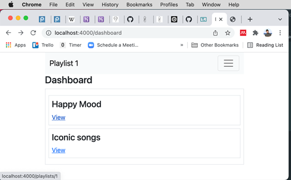

# Playlist Detailansicht

Zuerst Links ergänzen

Dashboard view: 

~~~ handlebars
    
    {{> menu id="dashboard"}} 
    <h3>Dashboard</h3> 
     
    
 
        {{#each playlists}} 
        
 
            <h4>{{title}}</h4> 
            <a href="/playlist/{{id}}">View</a> 
        
 
        {{/each}} 
    
 
    
~~~

Testen Sie die Anwendung. Leider funktioniert der Link nicht!

Pattern: As each playlist now has an ID, this can make this convenient to implement. Here is a new version of the view link: 

Hovern: 

Link Ziel Stimmt! Klick geht nicht – Testen! Was nun?

Dann Testen => Geht nicht 

~~~ shell
 CANNOT GET /playlists/1
~~~

-> Wir brauchen eine neue Route und einen neuen Controller! 