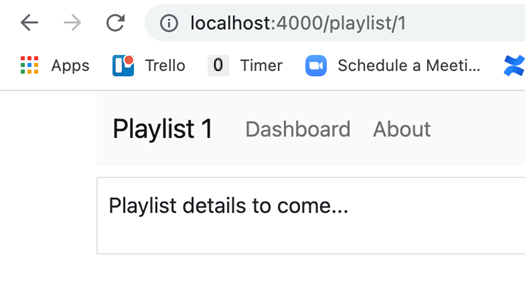

# Detailansicht der Playlisten – Playlist Controller, View, Route

Bringing in a new controller usually requires three things:

a controller

a view

a route

Here is is the new controller: 

~~~ js
const logger = require('../utils/logger'); 
const playlistStore = require('../models/playlist-store.js'); 
 
const playlist = { 
    index(request, response) { 
        const viewData = { 
            title: 'Playlist', 
        }; 
        response.render('playlist', viewData); 
    }, 
}; 
 
module.exports = playlist; 
~~~

Rendert den View Playlist.
Anlegen playlist.hbs 

~~~ handlebars
{{> menu}} 
 

 
    
Playlist details to come...
 

 
~~~

Finally, the route. This will require the controller to be imported at the top of the module: `const playlist = require("./controllers/playlist.js"); `

and then we can add the new route: `router.get('/playlist/:id', playlist.index); `

Notice that the route includes this segment: /:id. This means it matches any route that includes an extra wildcard segment at the end.

Implement all of the above now and verify that the view is rendered as expected.

It does not display the playlist yet - just a placeholder for the moment: 
