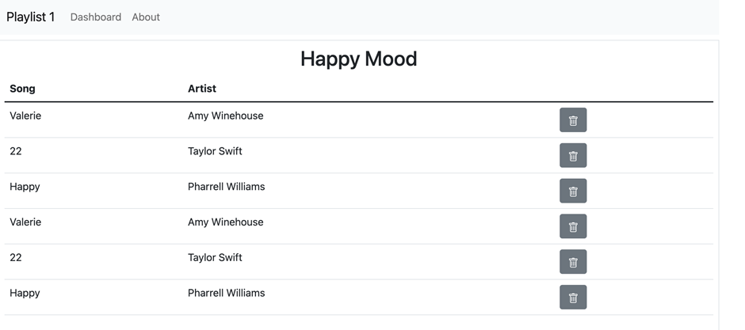

# Löschen

Having a playlist app, without the ability to create/delete songs or playlists is clearly very limited. We have, essentially, an app that allows us to Read our models, but not Create, Update or Delete elements of the model.

We can start with providing a facility to delete songs from individual playlists. At the end of this step our view will look like this: 

Pressing the delete button should remove the corresponding song.

Any new button/link/action on our page requires:

an element in a view

a route matching the view element

a matching controller function

.. and it may also involve some interaction with the model.

View

The new button must appear in each song row: 

~~~ html
<td> 
    <a class="btn btn-secondary" href="/playlist/{{playlist_id}}/deletesong/{{id}}" role="button"> 
        <svg xmlns="http://www.w3.org/2000/svg" width="16" height="16" fill="currentColor" class="bi bi-trash" viewBox="0 0 16 16"> 
            <path d="M5.5 5.5A.5.5 0 0 1 6 6v6a.5.5 0 0 1-1 0V6a.5.5 0 0 1 .5-.5zm2.5 0a.5.5 0 0 1 .5.5v6a.5.5 0 0 1-1 0V6a.5.5 0 0 1 .5-.5zm3 .5a.5.5 0 0 0-1 0v6a.5.5 0 0 0 1 0V6z"/> 
            <path fill-rule="evenodd" d="M14.5 3a1 1 0 0 1-1 1H13v9a2 2 0 0 1-2 2H5a2 2 0 0 1-2-2V4h-.5a1 1 0 0 1-1-1V2a1 1 0 0 1 1-1H6a1 1 0 0 1 1-1h2a1 1 0 0 1 1 1h3.5a1 1 0 0 1 1 1v1zM4.118 4 4 4.059V13a1 1 0 0 0 1 1h6a1 1 0 0 0 1-1V4.059L11.882 4H4.118zM2.5 3V2h11v1h-11z"/> 
        </svg> 
    </a> 
</td> 
~~~

Vgl. Bootstrap für das was wir tun: (Link zu Bootstrap)[https://icons.getbootstrap.com/icons/trash/]

Route

A new route - containing both the playlist and song id - and linking to a new function in the playlist controller:
`router.get('/playlist/:id/deletesong/:songid', playlist.deleteSong);`

Controller 
~~~ js
async deleteSong(request, response) { 
    const playlistId = request.params.id; 
    const songId = request.params.songid; 
    logger.debug(`Deleting Song ${songId} from Playlist ${playlistId}`); 
    await songStore.removeSong(songId); 
    response.redirect("/playlist/" + playlistId); 
}, 
~~~

Model: 
~~~ js
async removeSong(songId) { 
    const query = 'DELETE FROM playlist_songs WHERE id=$1'; 
    const values = [songId]; 
    try { 
        await dataStoreClient.query(query, values); 
    } catch (e) { 
        logger.error("Unable to remove song from playlist", e); 
    }; 
}, 
~~~

