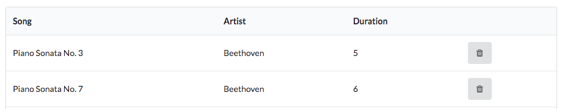

## Self Study

Eine vollständige Version dieses Labs finden Sie auch auf Github unter:
(Github Playlist V3)[https://github.com/OTHRegensburgWebDevKIDS/playlist-3]

Denken Sie daran vor dem ersten Ausführen mit `npm install` innerhalb des Ordners alle Pakete zu installieren.

### Aufgabe 1: Dauer anzeigen von Song und Playlist
Zeigen Sie die Dauer von allen einzelnen Songs und der Playlist an.
Das Ergebnis sollte nach Ihren Modifikationen dann wie folgt aussehen:

### Aufgabe 2: Dauer eines Liedes im Formular ergänzen.
Das in diesem Lab ergänzte Formular zum Hinzufügen von Songs zu einer Playlist ist zwar funktional, hat aber nach der Beendigung der Übung 1 das Problem, dass in diesem keine Zeiten eines Musik-Stückes angegeben werden.
Nachdem somit die Gesamtdauer einer Playlist nicht errechnet werden kann, muss dies auf jeden Fall geändert werden. 

Passen Sie dazu das Formular und alle dazu gehörenden Elemente so an, dass Sie den Artisten,den Titel und die Gesamtdauer eines Musikstückes eingeben können.
Das Ergebnis sollte dann wie folgt aussehen:

Vergewissern Sie sich, dass die Dauer auch in der Datenbank richtig gespeichert wird und somit auch im View korrekt dargestellt wird.

***Tipp***: Der Parameter der Dauer wird Ihnen aus dem Formular in einem falschen Format geliefert, dass vor dem Speichern erst noch gecastet werden muss. Richten Sie sich bei Problemen nach folgendem Beispiel:
~~~ js 
    const newSong = {
      id: uuid(),
      title: request.body.title,
      artist: request.body.artist,
      duration: Number(request.body.duration), // hier wird gecastet.
    };
~~~