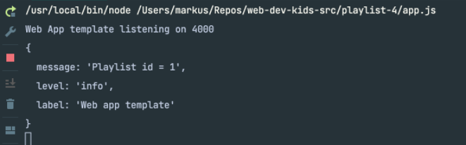

## Anpasssung Controller

Accounts Controller importieren (da muss man was erklären warum!)
~~~ js
const accounts = require("./accounts.js"); 
~~~

Index updaten:
~~~js
async index(request, response) { 
  const loggedInUser = await accounts.getCurrentUser(request); 
  const playLists = await playlistStore.getUserPlaylists(loggedInUser.id); 
  const viewData = { 
    title: "Playlist Dashboard", 
    playlists: playLists, 
  }; 
  logger.info("about to render dashboard", playLists); 
  response.render("dashboard", viewData); 
}, 
~~~

Playlist Model erweitern:
~~~js
async getUserPlaylists(email) { 
  const query = 'SELECT * FROM playlist4_playlists WHERE user_id=$1'; 
  const values = [email]; 
  try { 
    let result = await dataStoreClient.query(query, values); 
    return result.rows; 
  } catch (e) { 
    logger.error("Error fetching playlists for user: ", e); 
  } 
}, 
~~~

Add Playlist

models/playlist-store.js /
~~~ js
async addPlaylist(playList) { 
  try { 
    const query = 'INSERT INTO playlist4_playlists (TITLE, USER_ID) VALUES($1, $2)'; 
    const values = [playList.title, playList.userid]; 
    await dataStoreClient.query(query, values); 
  } catch (e) { 
    logger.error("Error cannot add playlist", e); 
  } 
}, 
~~~

Was ist der Unterschied – Können Sie es erklären?

Bis jetzt alles OK, Registrierung und Login! Aber Server neustarten (d.h. User ist ausgeloggt) und dann versuchen auf /dashboard zuzugreifen! Was passiert?

Oder noch schlimmer, Zugriff auf /playlist/1 funktioniert, hier die Logausgabe und zeigt die Daten der Playlist an 

Folgende Logs sollten Sie sehen:

Folgende Fehler bekommen Sie:

Was besagt diese Fehlermeldung? Warum erscheint sie? 