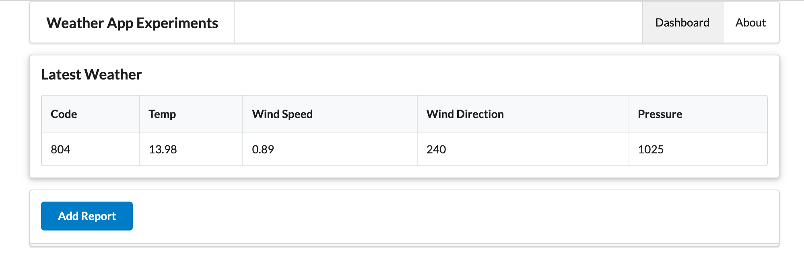

## Wetter Anzeigen

Unsere Applikation soll nun auf dem Dashboard das aktuelle Wetter in Form einer Tabelle anzeigen.
Immer wenn der *Add Report* Knopf gedrückt wird, sollen sich die Daten aktualisieren.



Dazu werden weitere partielle Views benötigt.

### views/partials/reading-header.hbs
```handlebars
<tr>
  <th> Code </th>
  <th> Temp </th>
  <th> Wind Speed </th>
  <th> Wind Direction </th>
  <th> Pressure </th>
</tr>
```
### views/partials/reading-row.hbs
```handlebars
<tr>
  <td> {{reading.code}}   </td>
  <td> {{reading.temperature}} </td>
  <td> {{reading.windSpeed}} </td>
  <td> {{reading.windDirection}} </td>
  <td> {{reading.pressure}} </td>
</tr>
```

### view/partials/readling-table.hbs
```handlebars
<table class="ui celled table">
  <thead>
    {{> reading-header }}
  </thead>
  <tbody>
    {{> reading-row }}
  </tbody>
</table>
```

Nach der Anpassung der Views können nun auch die Routen angepasst werden: 
### routes.js
```js
 router.post("/dashboard/addreport", dashboard.addreport);
```

Und wiederrum danach der Controller des Dashboards:
### controllers/dashboard.js
```js
  async addreport(request, response) {
    logger.info("rendering new report");
    const report = {};
    const viewData = {
      title: "Weather Report",
      reading : report
    };
    response.render("dashboard", viewData);
  },
```
Denken Sie die daran, die weiteren Partials (wie den Button) anzufertigen und im Dashboard zu integrieren.

Die Applikation sollte dann ohne Probleme laufen, aber noch keinerlei Daten angezeigt werden.
Die Verbindung mit der API wird nun implementiert.