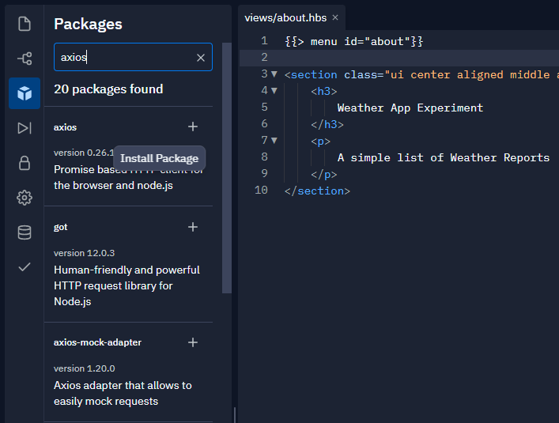

## API Calls mit AXIOS

Um mit der API zu kommunizieren wird eine weitere Komponente benötigt. 
Einer der bekanntesten Module ist [*Axios*](https://axios-http.com/)

Installieren Sie das Packet in Replit, indem Sie in der linken Funktionsleiste nach Packages suchen und dieses mit dem **+** installieren.

