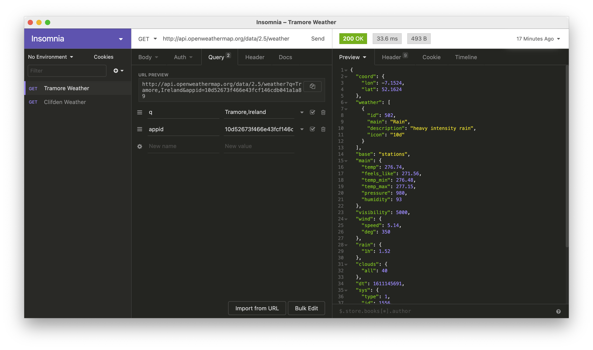
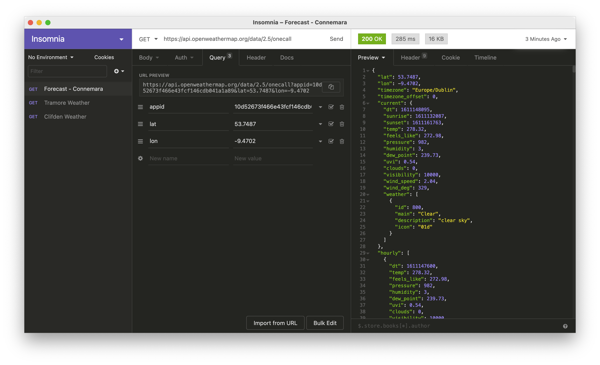

## Übungen

### Übung 1 - Insomnia API Tool

Für das Erstellen von API Requests können Sie, statt dem Browser auch Tools wie Insomnia nutzen.

Den Rest Client für API Experimente finden Sie auf der [offiziellen Download Seite](https://insomnia.rest/download)

Installieren Sie die Applikation und erstellen Sie die bereits bekannten Requests für das aktuelle Wetter in einer Stadt Ihrer Wahl.

Geben Sie dabei als URl an:
``` text
    http://api.openweathermap.org/data/2.5/weather
```
Und ergänzen Sie den angefragten Ort und Ihren API Key in den Request Feldern nach folgendem Beispiel:



### Übung 2 - Wetter Vorhersage

Neben der API Schnittstelle für das aktuelle Wetter bietet OpenWeatherMap auch die Abfrage von Vorhersagen an.

Die Dokumentation finden sie [hier](https://openweathermap.org/api/one-call-api).

Versuchen Sie nun diese API zu nutzen, um sich eine Vorhersage für Ihren Wohnort geben zu lassen.

