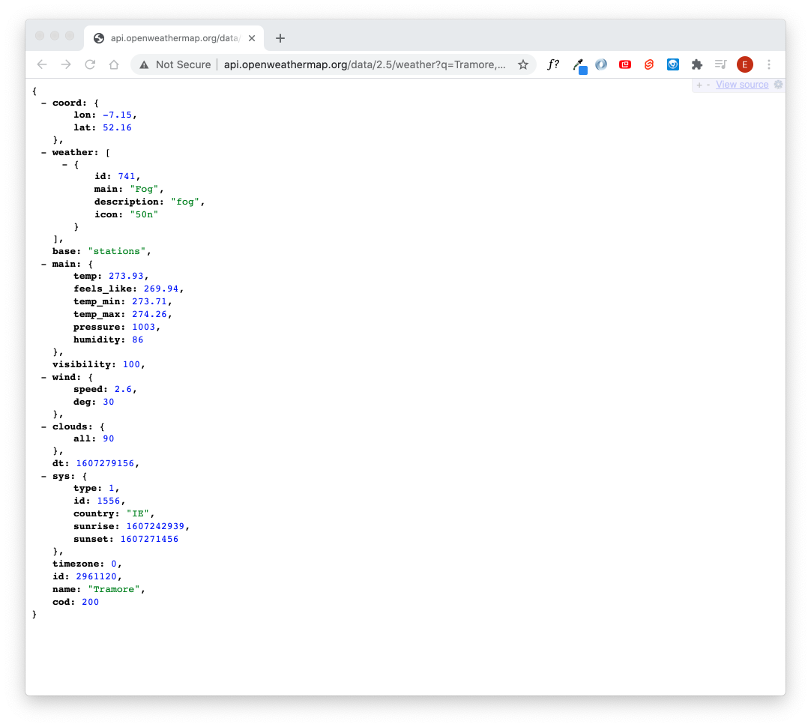

## Aktuelles Weather

Hier finden Sie die Dokumentation für die API, die Ihnen aktuelle Wetterdaten gibt: [Open Weather Doku](https://openweathermap.org/current).


Einen API Request können wir testweise auch einfach im Browser machen. Ergänzen Sie dazu in folgendem String Ihren API-Key und kopieren den Text dann in einen Browser Ihrer Wahl.
``` text
    http://api.openweathermap.org/data/2.5/weather?q=Tramore,Ireland&appid=YOUR_API_KEY
```
Im Browser sollten Sie dann eine Antwort der OpenWeatherApi sehen können.



Beachten Sie, dass die Daten auch anders visualisiert werden können. Das erhaltene Objekt ist ein Json Objekt, dass je nach Anwendung entweder schon formatiert dargestellt wird, oder im Rohformat angezeigt wird.
Für die bessere Darstellung von JSON Objekten helfen Plugins, wie [JSONView für Google Chrome](https://chrome.google.com/webstore/detail/jsonview).

Versuchen Sie nun das Wetter für ander Städte abzufragen, indem sie den API Request modifzieren.
Dazu finden sie innerhalb Ihrer bereits gestellten Anfrage den Bereich:
``` text
    ?q=Tramore,Ireland
```
Hier wird der gesuchte Ort übergeben. Indem Sie die Stadt ändern, können Sie das Wetter für jeden beliebigen Ort erhalten.

Die Stadt Tromsø in Norwegen könnte zum Beispiel eine solche Antwort geben:
``` json
    {
    coord: {
    lon: 18.96,
    lat: 69.65
    },
    weather: [
    {
    id: 801,
    main: "Clouds",
    description: "few clouds",
    icon: "02n"
    }
    ],
    base: "stations",
    main: {
    temp: 269.05,
    feels_like: 263.55,
    temp_min: 268.15,
    temp_max: 269.82,
    pressure: 1017,
    humidity: 92
    },
    visibility: 10000,
    wind: {
    speed: 4.1,
    deg: 100
    },
    clouds: {
    all: 20
    },
    dt: 1607279413,
    sys: {
    type: 1,
    id: 1681,
    country: "NO",
    sunrise: 0,
    sunset: 0
    },
    timezone: 3600,
    id: 6453316,
    name: "Tromsø",
    cod: 200
    }
```