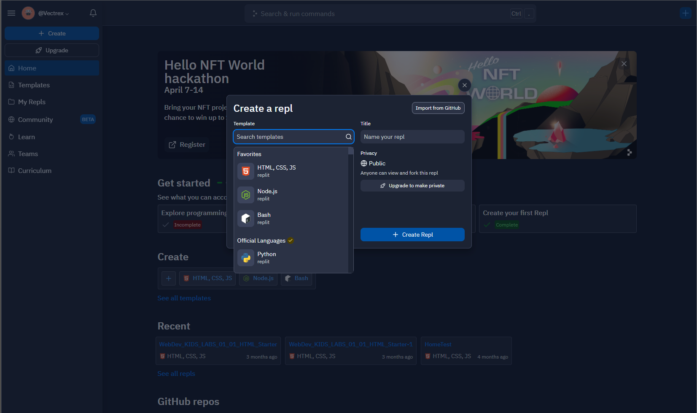
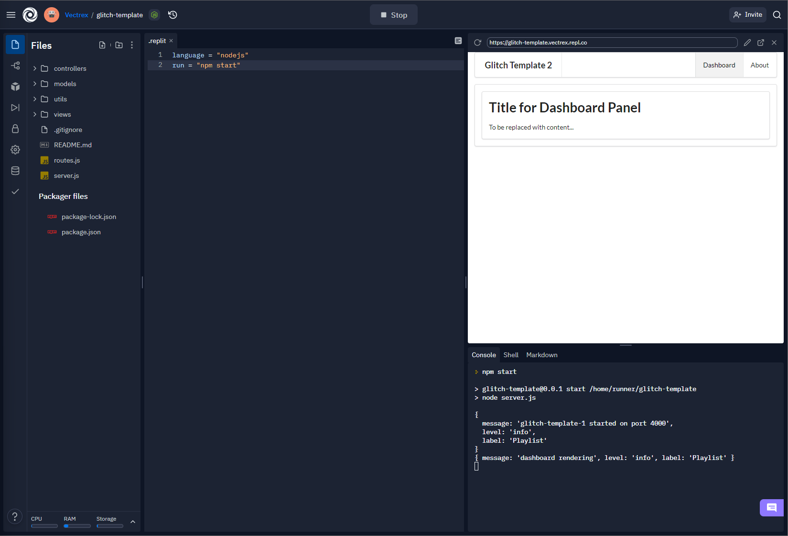

## Setup

Um zu lernen, wie man APIs innerhalb von Javascript nutzt, werden Sie ein Replit Projekt erstellen und darin eine API Abfrage durchführen.

Begeben Sie sich dazu auf die [Replit Startseite](https://replit.com/) und melden Sie sich mit Ihrem Nutzer an.

Erstellen Sie dann über den Button im Menü ein neues Projekt und wählen Sie *Import from Github*:



Im auftauchenden modalen Dialog müssen Sie dann folgende URL einfügen:
``` text  
    https://github.com/wit-hdip-comp-sci-2021/glitch-template
```


Das Projekt braucht dann eine kurze Zeit um zu laden. Wichtig ist, dass Sie in Replit noch definieren, was für eine Applikation Sie gecloned haben.
Bestätigen Sie damit die Vorauswahl im recht-oberen Fenster mit dem Button *Done*:


Mit dem *Run* Button der IDE können Sie die App dann starten.
Die Anwendung öffnet sich dann in einem kleinen Fenster auf der rechten Seite.


