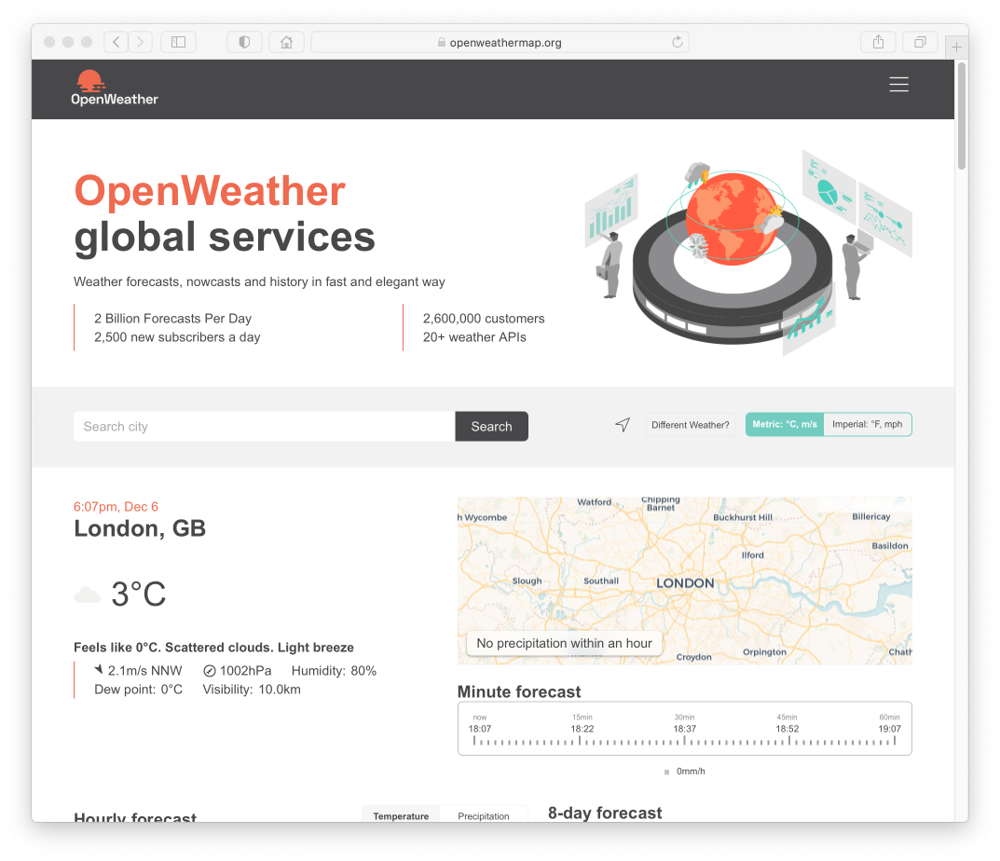

## Open Weather

Besuchen Sie die Startseite [der OpenWeather API](https://openweathermap.org).

Mit der Suche nach einem Ort sollten Sie verschiedene Wetterdaten für Ihren Ort finden:

Registrieren Sie sich nun auf der Website und loggen Sie sich ein. Wählen Sie dann den Punkt *Api* im Menü.

Wählen Sie `Current Weather Data` und drücken Sie auf `Subscribe`. 
Sie müssten nun die Möglichkeit haben verschiedene Lizenzen zu wählen.
Die *Free* API Lizenz reicht für das Projekt aus. Wählen Sie diese über einen Druck auf `Get API Key` aus.

Auf der nun geladenen Seite können Sie einen API Key erstellen und diesem auch einen Namen geben. 

Bevor Sie die API nun testen können, kann es sein bis zu 2h warten zu müssen. Typischerweise sollte es aber weniger als 10min dauern.
Für weitere Infos finden Sie ein FAQ unter [diesem Link](https://openweathermap.org/faq).